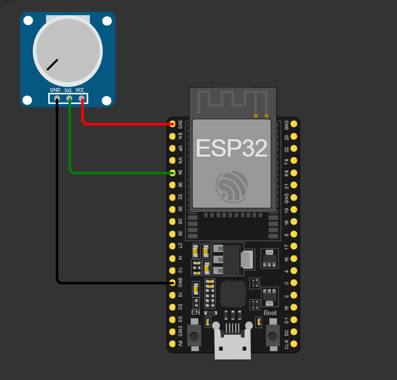

# GS Edge 2024
Global Solution da turma 1-ESPK 2024 . 

Grupo: EcoSense
<table>
  <tr>
    <th>Nomes</th>
    <th>Rm</th>
  </tr>
  <tr>
    <td>Gustavo Pierre Santos Silva</td>
    <td>558928</td>
  </tr>
  <tr>
    <td>Eric Megherdijian Darakjian</td>
    <td>557082</td>
  </tr>
  <tr>
    <td>Luciano Henrique Meriato Junior</td>
    <td>554546</td>
  </tr>
</table>

<h1>Link Para o projeto</h1>
https://wokwi.com/projects/415105141095711745

<h1>Materiais:</h1>
<ul>
  <li>ESP32</li>
  <li>Potênciometro</li>
</ul>

<h1>Foto do sistema:</h1>

<h2>Explicação do projeto</h2>
Nós implementamos um projeto que utiliza o ESP32 para monitorar o uso de energia, utilizamos o potênciometro para simular o ACS712(Sensor de Energia). Nosso objetivo foi monitorar e prever o uso exacerbado de energia.
 
<h2>O que fizemos:</h2>
 
1. Montagem dos Sensores:
  - Conectamos o potenciometro ao ESP32 para simular o uso de energia.

 
2. Programação do ESP32:
  - Desenvolvemos o código para fazer leituras constantes desse sensor.
  - Incluimos as bibliotecas necessárias para o desenvolvimento do projeto. Então configuramos a conexão do ESP32 a uma rede Wi-Fi e integramos com o protocolo HTTP para enviar os dados coletados para um servidor(Webhook).

 
3. Envio de Dados ao Servidor:
  - Usamos o programa Webhook para enviar os dados do sensor.
  - Os dados eram enviados em formato JSON, contendo as leituras de energia.

 
4. Site Webhook:
  - Configuramos o código com o IP para ler os dados que foram enviados pelo ESP32.
  - A partir do Webhook, conseguimos visualizar em tempo real o uso de energia.

 
<h2>Por que é importante?</h2>
Com este sistema, podemos monitorar de forma remota e em tempo real o consumo de energia, garantindo que a mesma se mantenha em condições adequadas para evitar o consumo exacerbado de energia.
Em resumo, desenvolvemos um sistema de monitoramento de IoT eficiente e prático, utilizando  um potenciometro e o ESP32, que transmite os dados através da rede para facilitar a tomada de decisões rápidas e precisas sobre o consumo de energia.
